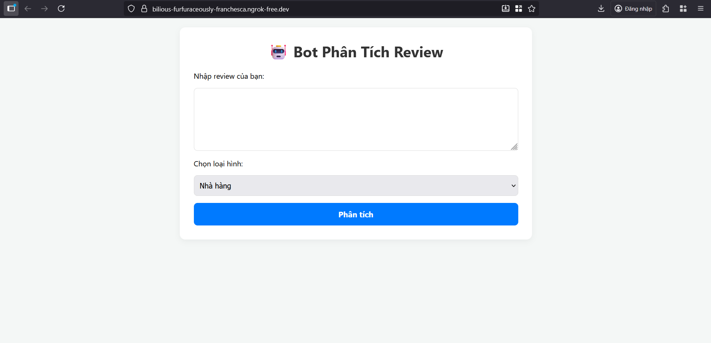
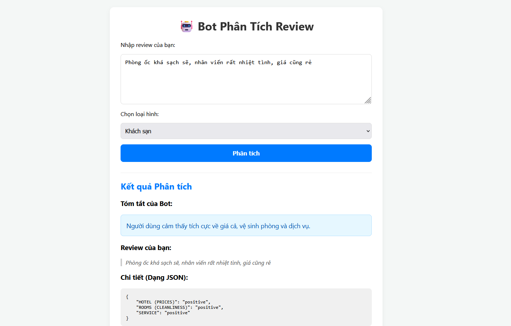
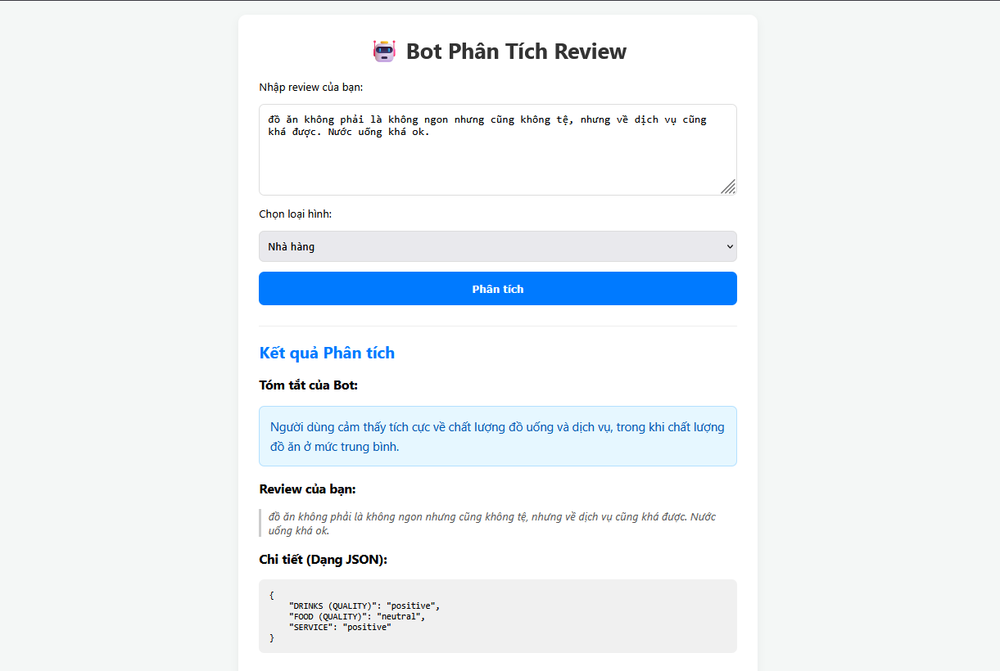
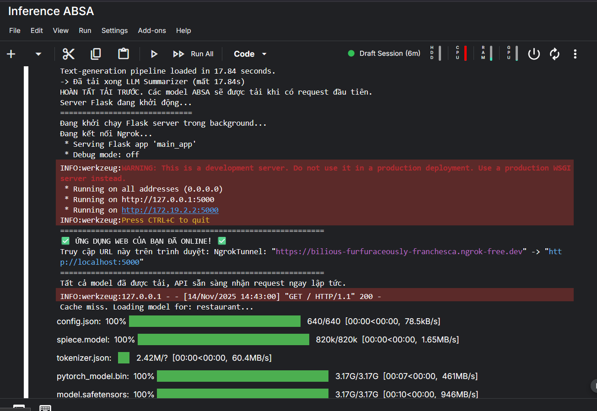

# ABSA-RAG Vietnamese Restaurant & Hotel Bot

A complete pipeline for **Aspect-Based Sentiment Analysis (ABSA)**
combined with **Retrieval-Augmented Generation (RAG)** to build an
intelligent Vietnamese chatbot for **restaurant and hotel customer
support**.

This system is designed to: - Detect **aspects** from user queries\
- Classify **sentiment** for each aspect\
- Combine with **RAG** to generate natural and informative responses\
- Support **deployment** with Flask + Ngrok\
- Provide **full inference notebook**

------------------------------------------------------------------------

## 🚀 Features

-   Official UIT-ViABSA datasets (Hotel + Restaurant)\
-   Training notebooks for both domains\
-   Visualization notebook (loss, confusion matrix, attention maps)\
-   Unified inference pipeline (ABSA → RAG → Response)\
-   Fully compatible with Qwen, LLaMA, Gemini, ViLM\
-   Deployable through Flask with online tunneling (Ngrok)

------------------------------------------------------------------------

## 📁 Project Structure

    ABSA-RAG-Vietnamese-Restaurant-Hotel-Bot
    │
    ├── dataset/
    │   ├── UIT-ABSA-Hotel/
    │   └── UIT-ABSA-Restaurant/
    │
    ├── img/
    │
    ├── train/
    │   ├── train_hotel.ipynb
    │   ├── train_restaurant.ipynb
    │   └── visualization.ipynb
    │
    ├── inference/
    │   └── inference-absa-bot.ipynb   ← NEW
    │
    └── README.md

------------------------------------------------------------------------

## 🧩 System Overview (ABSA + RAG)

### **1️⃣ ABSA Pipeline**

-   Input sentence\
-   Tokenization\
-   Aspect category prediction\
-   Sentiment classification\
-   Output example:

```{=html}
<!-- -->
```
    {
      "aspect": "SERVICE#GENERAL",
      "sentiment": "positive"
    }

### **2️⃣ RAG Pipeline**

-   Retrieve top-K relevant passages\
-   Combine user query + retrieved context\
-   LLM synthesizes a natural answer\
-   Sentiment from ABSA is integrated into final answer

------------------------------------------------------------------------

## 🔍 Dataset Overview (UIT-ViABSA)

  Domain           Train   Dev   Test
  ---------------- ------- ----- ------
  **Hotel**        4200    600   600
  **Restaurant**   1800    300   300

Example:

    Sentence: "Nhân viên phục vụ rất nhiệt tình."
    Aspect: SERVICE#GENERAL
    Sentiment: Positive

------------------------------------------------------------------------

## 🎓 Training Notebooks

  -----------------------------------------------------------------------
  Notebook                            Purpose
  ----------------------------------- -----------------------------------
  `train/train_hotel.ipynb`           Train ABSA for hotel domain

  `train/train_restaurant.ipynb`      Train ABSA for restaurant domain

  `train/visualization.ipynb`         Loss plots, label distribution,
                                      confusion matrix, attention
  -----------------------------------------------------------------------

------------------------------------------------------------------------

## 🖼 Demo Images

### Start



### Hotel



### Restaurant



### Ngrok



------------------------------------------------------------------------

# 🧠 Inference --- Running ABSA + RAG Bot

📌 **Notebook:** `inference/inference-absa-bot.ipynb`

------------------------------------------------------------------------

## **1️⃣ Load Trained ABSA Model**

``` python
from transformers import AutoTokenizer, AutoModelForSequenceClassification
import torch

model_path = "models/hotel_absa"     # or restaurant_absa
tokenizer = AutoTokenizer.from_pretrained(model_path)
model = AutoModelForSequenceClassification.from_pretrained(model_path)
```

------------------------------------------------------------------------

## **2️⃣ Run Aspect + Sentiment Prediction**

``` python
def predict_absa(sentence):
    inputs = tokenizer(sentence, return_tensors="pt", truncation=True)
    outputs = model(**inputs)
    logits = outputs.logits
    probs = torch.softmax(logits, dim=-1)
    pred = torch.argmax(probs, dim=-1).item()
    return pred, float(probs[0][pred])
```

------------------------------------------------------------------------

## **3️⃣ Integrate with RAG Answering**

``` python
def rag_answer(user_query, absa_result):
    prompt = (
        f"User query: {user_query}
"
        f"Aspect: {absa_result['aspect']}
"
        f"Sentiment: {absa_result['sentiment']}

"
        "Provide a polite and context-aware response suitable for hotel/restaurant situations."
    )
    response = llm(prompt)
    return response
```

------------------------------------------------------------------------

## **4️⃣ Full Inference Pipeline**

``` python
def run_bot(query):
    aspect, senti = predict_absa(query)
    absa_pack = {"aspect": aspect, "sentiment": senti}

    answer = rag_answer(query, absa_pack)

    return {
        "input": query,
        "absa": absa_pack,
        "response": answer
    }
```

------------------------------------------------------------------------

## 🌐 Deployment (Flask + Ngrok)

Start tunnel:

``` bash
ngrok http 5000
```

Run API:

``` bash
python app.py
```

------------------------------------------------------------------------

## 🔮 Future Improvements

-   Multi-aspect ABSA\
-   Intent detection integration\
-   FAISS GPU retrieval\
-   Support LLM 1.5B--7B\
-   Build a full web chatbot interface

------------------------------------------------------------------------

## 👨‍💻 Author

**Tiến Quốc Bảo**\
GitHub: https://github.com/tienquocbao

------------------------------------------------------------------------

## 📄 License

MIT License
